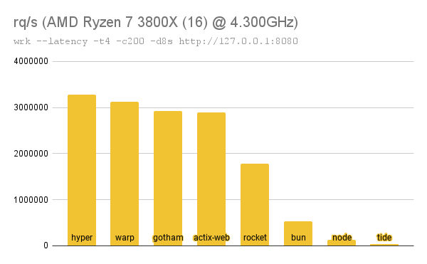

# Benchmarking Rust Web Frameworks

Additionally comparison to Bun and Node is provided.

## Benchmarking Tool

```sh
$ wrk --latency -t4 -c200 -d8s http://127.0.0.1:8081
```

All benchmarks are run on `AMD Ryzen 7 3800X (16) @ 4.300GHz, 16GB of RAM`

Before run, I created a release build:

```sh
$ cargo build --release
```

Then benchmark is run 4 times in a row and averages are calculated.

## Results


